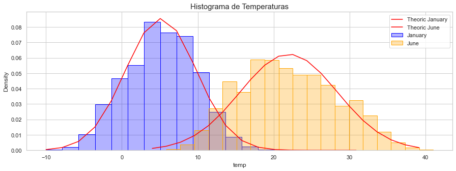

# Primera Práctica Análisis  

 Marta Barbolla Galán, Covadonga Galán Fernandez, Victor Galván Fraile, Diego García Moroto y Nagore Meabe Yanguas
  

---
Esta práctica sirve de introducción al manejo de datos de distintos tipos y a su procesado mediante
diversas técnicas básicas de inferencia estadística. Se procederá también a la representación de estos datos mediante distintas técnicas de visualización como son los histogramas o los diagramas de “cajas y bigotes” (o *boxplot*, en inglés).

Se trabajará con bases de datos diversas referidas aproximadamente a una misma localización y se emplearán técnicas estadísticas como el contraste de hipótesis para determinar cuestiones como si los datos de las bases se corresponden a una misma población o si ha habido un cambio climático significativo. Para esta observación de los posibles cambios en el clima también se emplearán diversos test estadísticos. Se trabajará además la representación de datos en mapas y el cálculo de series temporales de anomalías.

